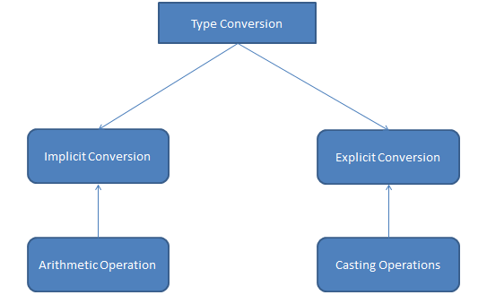

# Implicit and Explicit Type Casting in C
## 🔹 Implicit Type Casting (Type Conversion)

- Also called type promotion.

- Done automatically by the compiler.

- Happens when a smaller data type is converted to a larger data type to prevent data loss.

- No data is lost, but sometimes precision might be.

**Example:**
```c
#include <stdio.h>
int main() {
    int a = 10;
    float b = a;  // int automatically converted to float (implicit)

    printf("a = %d\n", a);
    printf("b = %.2f\n", b);
    return 0;
}
```
**Output:**
```ini
a = 10
b = 10.00
```
## 🔹 Explicit Type Casting (Type Conversion)

- Also called type casting or type conversion.

- Done manually by the programmer using cast operator (type).

- Used when we want to forcefully convert one data type to another.

**Example:**
```c
#include <stdio.h>
int main() {
    float x = 10.75;
    int y = (int)x;   // Explicit type casting (float to int)

    printf("x = %.2f\n", x);
    printf("y = %d\n", y);
    return 0;
}
```
**Output:**
```ini
x = 10.75
y = 10
```
## ✅ Key Differences:
| **Aspect**            | **Implicit Casting**          | **Explicit Casting**                 |
| --------------------- | ----------------------------- | ------------------------------------ |
| **Who does it?**      | Compiler                      | Programmer                           |
| **Syntax**            | Automatic (no special syntax) | `(data_type) variable`               |
| **Risk of data loss** | Low (usually promotes safely) | Higher (may lose precision/truncate) |
| **Example**           | `int → float` automatically   | `(int) 10.75 → 10`                   |

