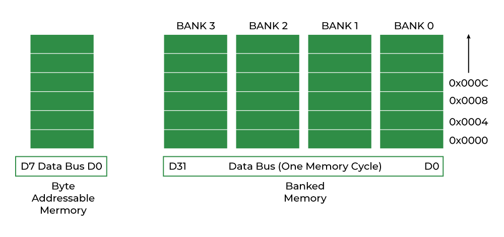

# Structure Padding and Packing in C
**🔹 Structure Padding**

- Padding is the process where the compiler adds extra bytes to a structure to make data aligned in memory.

- Most architectures require data to be aligned (e.g., ``int`` at a 4-byte boundary).

- This improves CPU performance (faster memory access).

**Example (Padding):**
```c
#include <stdio.h>

struct Padding {
    char a;   // 1 byte
    int b;    // 4 bytes
    char c;   // 1 byte
};

int main() {
    printf("Size of struct Padding: %lu\n", sizeof(struct Padding));
    return 0;
}
```
**Expected Output (on 32-bit/64-bit machine):**
```cpp
Size of struct Padding: 12
```
## 📌 Explanation:

- ``a`` → 1 byte

- `Compiler adds 3 padding bytes for alignment before b.

- ``b``→ 4 bytes

- ``c`` → 1 byte, but compiler adds 3 more padding bytes for alignment.

- Total = 12 bytes instead of 6.

## 🔹 Structure Packing

- Packing means telling the compiler not to add padding bytes.

- Achieved using #pragma pack(1) or compiler-specific attributes.

- Saves memory but can reduce performance due to misaligned access.

## Example (Packing):
```c
#include <stdio.h>
#pragma pack(1)   // Disable padding

struct Packing {
    char a;   // 1 byte
    int b;    // 4 bytes
    char c;   // 1 byte
};

int main() {
    printf("Size of struct Packing: %lu\n", sizeof(struct Packing));
    return 0;
}
```
**Expected Output:**
```cpp
Size of struct Packing: 6
```
**📌 Explanation:**

- ``a`` → 1 byte

- ``b`` → 4 bytes (immediately after ``a``)

- ``c`` → 1 byte

- Total = 6 bytes (no padding).

## ✅ Key Differences
| **Aspect**      | **Structure Padding**                   | **Structure Packing**               |
| --------------- | --------------------------------------- | ----------------------------------- |
| **Definition**  | Compiler adds extra bytes for alignment | No extra bytes, data tightly packed |
| **Size**        | Larger than sum of members              | Equal to sum of members             |
| **Performance** | Faster (aligned access)                 | Slower (unaligned access)           |
| **Use case**    | General coding, efficiency              | Memory-critical systems, networking |

