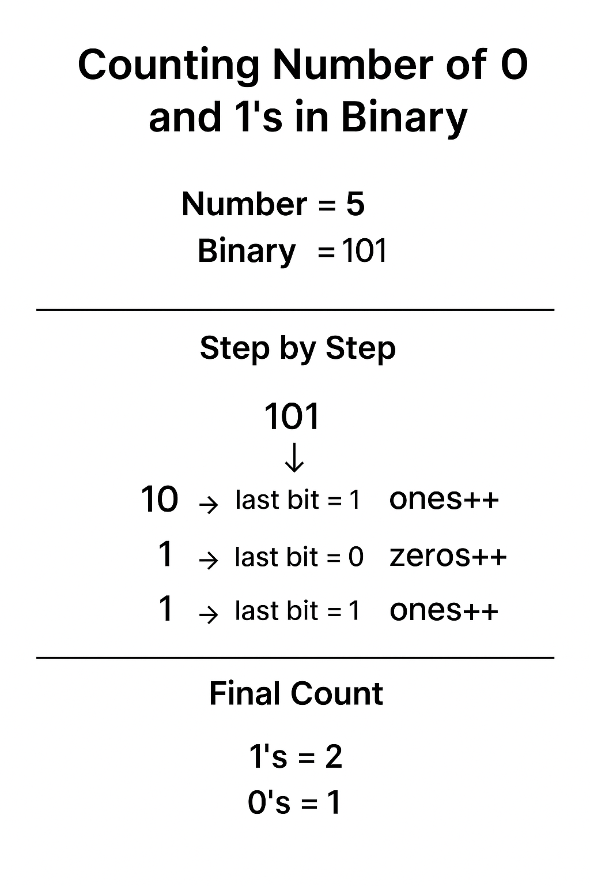

# Find Number of 0’s and 1’s in C
**🔹 Explanation**

Every integer in C is stored in binary format (0s and 1s).

- Each ``1`` represents a bit set.

- Each ``0`` represents a bit not set.

 To count them:

**1.** Take a number from the user.

**2.** Use bitwise AND (``&``) with ``1`` to check the last bit.

- If ``(num & 1)`` is true → bit is ``1``.

- Else → bit is ``0``.

**3.** Right shift the number (``num = num >> 1``) to check the next bit.

**4.** Repeat until the number becomes ``0``.

## 🔹 C Code
```c
#include <stdio.h>

int main() {
    unsigned int num;
    int ones = 0, zeros = 0;

    printf("Enter a number: ");
    scanf("%u", &num);

    unsigned int temp = num; // keep a copy

    while (temp > 0) {
        if (temp & 1)
            ones++;
        else
            zeros++;
        temp = temp >> 1;  // shift right by 1 bit
    }

    printf("Binary representation of %u has:\n", num);
    printf("Number of 1's = %d\n", ones);
    printf("Number of 0's = %d\n", zeros);

    return 0;
}
```
## 🔹 Example Run
```vbnet
Enter a number: 5
Binary representation of 5 has:
Number of 1's = 2
Number of 0's = 1
```
**📌 Explanation:**

- 5 in binary → 101

- 2 ones and 1 zero

## ⚡ Note:

- This program only counts bits up to the most significant bit.

- If you want to count across all 32 bits (including leading zeros), you can use the sizeof(int) * 8 method I showed earlier.

