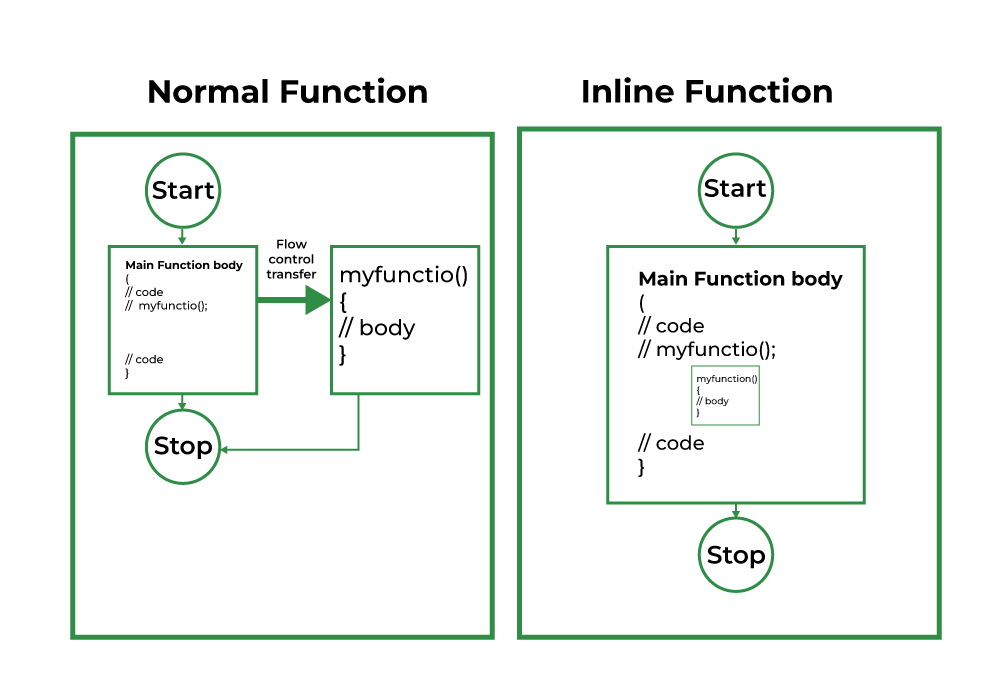
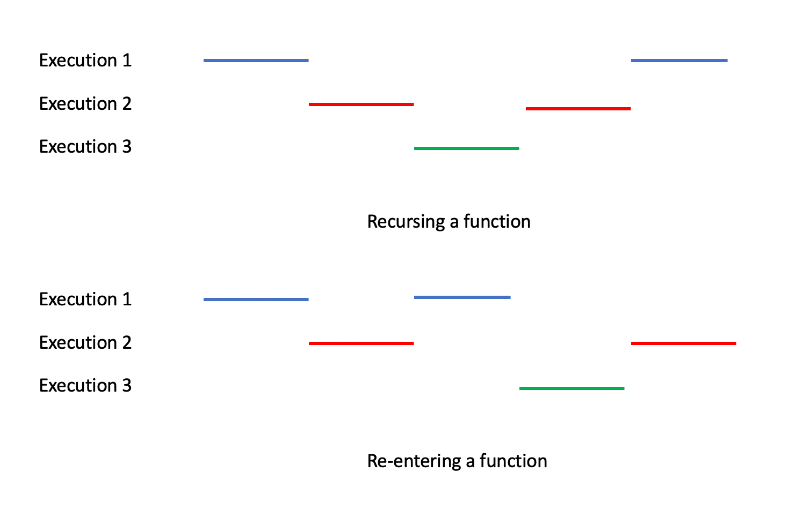

# 🔹 Inline Function in C

- **Definition**: An inline function is a function that is expanded in place (like a macro) instead of being called through the normal function-call mechanism.

- Declared using the keyword ``inline``.

- Main aim: Eliminate function call overhead (stack push/pop, jump, return).

- Works best with small, frequently used functions.

**Example:**
```c
#include <stdio.h>

inline int square(int x) {
    return x * x;
}

int main() {
    int n = 5;
    printf("Square = %d\n", square(n));
    return 0;
}
```
**Output**
```ini
Square = 25
```
Here, instead of actually calling square(n), the compiler may replace it directly with n * n.

**✅ Advantages:**

- Faster execution for small functions.

- Readability + efficiency.

**``❌`` Limitations:**

- Only a request to the compiler (compiler may ignore it).

- Not good for large functions → increases code size (code bloat).

- Cannot handle recursion well.

# 🔹 Reentrant Function in C

- **Definition**: A reentrant function is one that can be safely interrupted and called again (“re-entered”) before its previous execution is complete.

- Mostly used in multi-threaded or interrupt-driven environments.

- Key Point: A function is reentrant if it does not use shared or static data without protection.

## Rules for a function to be reentrant:

- **1.** Do not use static or global variables (unless protected with locks).

- **2.** Do not use static or global vaOnly use local variables.

- **3.** Do not use static or global vaDo not call non-reentrant functions.

- **4.** Do not use static or global vaNo modification of shared resources without synchronization.

**Example (Non-Reentrant Function ``❌``):**
```c
int counter = 0;  // global variable

int increment() {
    return ++counter;  // uses shared state → NOT reentrant
}
```
**Example (Reentrant Function ✅):**
```c
int increment(int counter) {
    return counter + 1;  // only uses local data → reentrant
}
```
## 🔑 Difference (Inline vs Reentrant)
| Feature    | Inline Function 🚀               | Reentrant Function 🔄                             |
| ---------- | -------------------------------- | ------------------------------------------------- |
| Purpose    | Speed optimization (avoid call)  | Safe for concurrency & interrupts                 |
| Concern    | **Performance**                  | **Safety** (thread/interrupt)                     |
| Works with | Small, frequently used functions | Multi-threading, ISR (interrupt service routines) |
| Risk       | Code bloat if large              | Race conditions if not reentrant                  |



