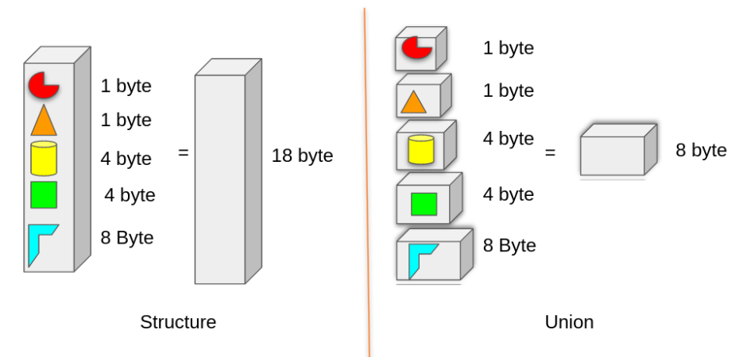

## 🔹 Structure in C

- A structure is a user-defined data type that allows grouping of different data types under a single name.

- Each member gets its own memory.

- Total size = sum of sizes of all members (with padding/alignment).

**Example:**
```c
#include <stdio.h>

struct Student {
    int roll;
    char grade;
    float marks;
};

int main() {
    struct Student s1 = {101, 'A', 87.5};
    printf("Roll: %d, Grade: %c, Marks: %.2f\n", s1.roll, s1.grade, s1.marks);
    return 0;
}
```
**✅ Output:**
```yaml
Roll: 101, Grade: A, Marks: 87.50
```
**✔️ Explanation:**

- In a structure, all members have separate memory.

- So, ``roll = 101``, ``grade = 'A'``, ``marks = 87.5`` all coexist safely.

## 🔹 Union in C

- A union is also a user-defined data type that allows grouping of different data types under a single name.

- But all members share the same memory location.

- Total size = size of the largest member.

- At any given time, only one member can hold a meaningful value.

**✅ Syntax of Union:**
```c
union UnionName {
    data_type member1;
    data_type member2;
    ...
};
```
**Example:**
```c
#include <stdio.h>

union Data {
    int i;
    float f;
    char c;
};

int main() {
    union Data d;

    d.i = 10;  
    printf("i = %d\n", d.i);

    d.f = 3.14;   // overwrites the same memory
    printf("f = %.2f\n", d.f);

    d.c = 'A';    // overwrites again
    printf("c = %c\n", d.c);

    return 0;
}
```
**✅ Output (typical run):**
```ini
i = 10
f = 3.14
c = A
```

## 🔑 Difference Between Structure and Union
| Feature               | **Structure** 🏗️                           | **Union** 🔄                                                 |
| --------------------- | ------------------------------------------- | ------------------------------------------------------------ |
| **Memory Allocation** | Each member has its own memory              | All members share the same memory                            |
| **Size**              | Sum of sizes of all members (+padding)      | Size of the largest member                                   |
| **Storage**           | Can store values in **all members** at once | Can store value in **only one member** at a time             |
| **Use case**          | When you need to keep **all fields active** | When you need to save memory and use **one field at a time** |

