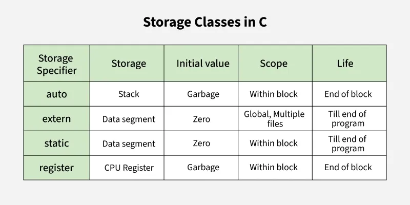

# Storage Classes in C

Storage classes in C define **scope (visibility)**, **lifetime (existence in memory)**, and **default value** of variables.

---

## 1. `auto` (Automatic Storage Class)
- Default for local variables inside functions.
- Stored in **stack memory**.
- **Scope:** Local to the block where defined.  
- **Lifetime:** Till the function/block executes.  
- **Default value:** Garbage.  

### Example
```c
void func() {
    auto int a = 10; // 'auto' is optional
    printf("%d", a);
}
```

## 2. register

- Suggests storing the variable in a CPU register for faster access.
- Cannot get its address using &.
- Scope: Local to the block.
- Lifetime: Till the function/block executes.
- Default value: Garbage.

```c
void func() {
    register int i;
    for (i = 0; i < 5; i++)
        printf("%d ", i);
}
```
## 3. static

- Keeps the variable’s value between function calls.
- For global variables, static restricts scope to that file.
- Scope: Local to the block (if inside function) OR file-level (if global).
- Lifetime: Entire program execution.
- Default value: 0.

```c
void counter() {
    static int count = 0; // retains value
    count++;
    printf("%d\n", count);
}
```
## 4. extern

- Declares a global variable defined in another file or location.
- Scope: Global (across files).
- Lifetime: Entire program execution.
- Default value: 0.

```c
// file1.c
int num = 10;

// file2.c
extern int num; // tells compiler "num" exists elsewhere
printf("%d", num);
```
| Storage Class | Scope                  | Lifetime        | Default Value | Example           |
| ------------- | ---------------------- | --------------- | ------------- | ----------------- |
| auto          | Local (function/block) | Till block runs | Garbage       | `auto int a;`     |
| register      | Local (function/block) | Till block runs | Garbage       | `register int x;` |
| static        | Local/File             | Entire program  | 0             | `static int y;`   |
| extern        | Global (all files)     | Entire program  | 0             | `extern int z;`   |


