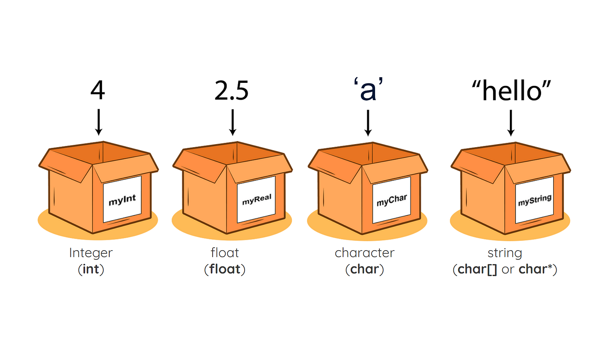

## 1. ``sizeof`` operator

- sizeof is a compile-time operator in C.

- It tells you how many bytes a data type or variable takes in memory.

👉 Example:
```c
#include <stdio.h>
int main() {
    printf("Size of int: %lu\n", sizeof(int)); //Size of int: 4
    printf("Size of char: %lu\n", sizeof(char)); //Size of char: 1
    printf("Size of float: %lu\n", sizeof(float)); //Size of float: 4
    printf("Size of double: %lu\n", sizeof(double));//Size of double: 8
    return 0;
}
```
## 2. Common sizes of basic data types

| Data Type         | Typical Size (bytes)         |
| ----------------- | ---------------------------- |
| `char`            | 1                            |
| `short`           | 2                            |
| `int`             | 4                            |
| `long`            | 4 (on 32-bit), 8 (on 64-bit) |
| `long long`       | 8                            |
| `float`           | 4                            |
| `double`          | 8                            |
| `long double`     | 16 (sometimes 12)            |
| `void*` (pointer) | 4 (on 32-bit), 8 (on 64-bit) |

## 3. Why use ``sizeof()``?
- Ensures portability (instead of assuming int = 4 bytes, check with sizeof(int)).

- Useful when allocating memory dynamically:
```c
int *arr = (int*) malloc(10 * sizeof(int));
```



