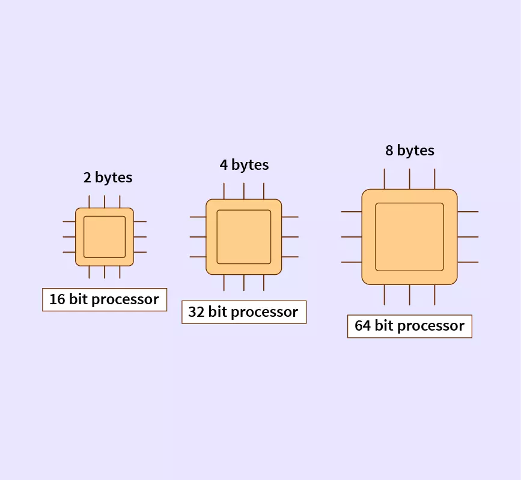

## 📌 Size of a Pointer in C

- The size of a pointer does NOT depend on the data type it points to.
(e.g., ``int*``, ``char*``, ``float*`` → all pointers are the same size).

- Instead, it depends on the system architecture (how many bytes are needed to store a memory address).

| System Architecture | Pointer Size |
| ------------------- | ------------ |
| 16-bit system       | 2 bytes      |
| 32-bit system       | 4 bytes      |
| 64-bit system       | 8 bytes      |

## Example Code
```c
#include <stdio.h>
int main() {
    printf("Size of int pointer: %lu\n", sizeof(int*));
    printf("Size of char pointer: %lu\n", sizeof(char*));
    printf("Size of float pointer: %lu\n", sizeof(float*));
    printf("Size of double pointer: %lu\n", sizeof(double*));
    return 0;
}
```
👉 On a ``64-bit machine``, the output will usually be:

```cpp
Size of int pointer: 8
Size of char pointer: 8
Size of float pointer: 8
Size of double pointer: 8
```


## ⚡ Key takeaway:

- Pointer size is uniform across data types, but it depends on the machine word size (32-bit vs 64-bit).

