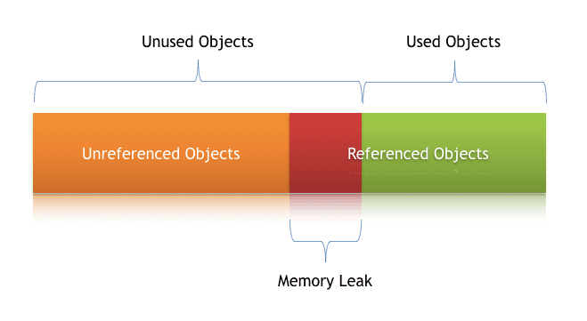

## 📌 Memory Leak in C

- **A memory leak** happens when:

- You allocate memory dynamically using ``malloc``, ``calloc``, or ``realloc``.

- But you **forget to free** it using ``free``.

- The memory stays reserved (unusable) until the program ends, even though you can’t access it anymore.

- This wastes RAM and, in long-running programs, can eventually crash the system.

**Example of Memory Leak**
```c
#include <stdio.h>
#include <stdlib.h>

int main() {
    int *p = (int*) malloc(5 * sizeof(int)); // allocated
    p = NULL;  // lost reference, memory is leaked
    return 0;  // memory never freed
}
```
Here, the pointer ``p`` was overwritten, so the allocated block is lost forever.

**Correct Way (Avoiding Leak)**
```c
#include <stdio.h>
#include <stdlib.h>

int main() {
    int *p = (int*) malloc(5 * sizeof(int));
    // use memory here
    free(p);  // release memory back to system
    p = NULL; // good practice
    return 0;
}
```
}

## ✅ Key Points

- Always pair every ``malloc/calloc/realloc`` with a ``free``.

-  Setting pointer to ``NULL`` after ``free`` avoids **dangling pointer** problems.

- Tools like Valgrind (Linux) help detect memory leaks.

