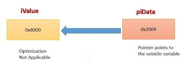

## 📌 ``volatile`` keyword in C

**The ``volatile`` keyword tells the compiler:**

👉 “This variable’s value can change at any time, outside of the program’s control. So, don’t optimize it away.”

- Normally, the compiler tries to optimize code by storing variables in registers and assuming values won’t change unexpectedly. But with hardware-related variables ``(like sensors, status registers, or shared memory)``, values can change. volatile prevents wrong assumptions.

## Example (without ``volatile``)
```c
int flag = 0;

while (flag == 0) {
    // compiler may optimize this loop as infinite
}
```
If ``flag`` is updated by hardware (like an interrupt), the compiler might still assume flag never changes and turn the loop into an infinite one.
## Example (with ``volatile``)
```c
volatile int flag = 0;

while (flag == 0) {
    // now compiler always re-checks the actual memory
}
```
**✅ Key Uses**

- Hardware registers (e.g., status flags, I/O ports).

- Global variables modified by interrupt service routines (ISRs).

- Multithreaded code (shared variables between threads).

**⚡ Key takeaway:**

- Use volatile when a variable can be changed by external factors (hardware, interrupts, or other threads).

