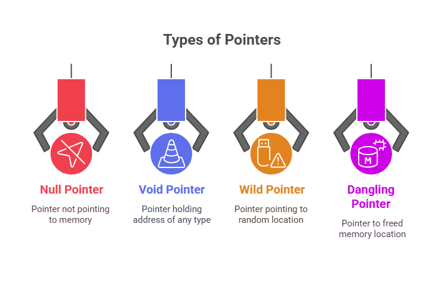

## 📌 1. Dangling Pointer

- A pointer that points to memory that has been freed or deleted.

- Accessing it leads to undefined behavior.

**Example**
```c
#include <stdio.h>
#include <stdlib.h>

int main() {
    int *p = (int*) malloc(sizeof(int));
    *p = 10;
    free(p);   // memory freed
    printf("%d", *p); // ❌ dangling pointer (illegal)
    return 0;
}
```
✅ Fix: Set ``p = NULL`` after ``free(p)``

## 📌 2. Wild Pointer

A pointer that is **declared but not initialized**.

- Points to some **random memory location**.

**Example.**
```c
int *p;     // wild pointer (no initialization)
*p = 10;    // ❌ undefined behavior
```
✅ Fix: Initialize pointer: ``int *p = NULL;``

## 📌 3. NULL Pointer

A pointer that is ``initialized with NULL (address 0)``.

- Safe to check before using.

- Commonly used to signal that a pointer is not pointing anywhere valid.

**Example**
```c
int *p = NULL;
if (p == NULL)
    printf("Pointer is empty\n");
```
## 📌 4. Void Pointer (Generic Pointer)

- Declared as ``void *``.

- Can point to any data type (generic).

- Cannot be dereferenced directly — must be cast first.

**Example**
```c
#include <stdio.h>

int main() {
    int x = 10;
    float y = 3.14;

    void *ptr;      // generic pointer

    ptr = &x;
    printf("%d\n", *(int*)ptr);  // cast to int*

    ptr = &y;
    printf("%f\n", *(float*)ptr); // cast to float*

    return 0;
}
```
| Pointer Type     | Meaning                                | Safe Fix/Use                 |
| ---------------- | -------------------------------------- | ---------------------------- |
| Dangling Pointer | Points to freed/deleted memory         | Set to `NULL` after `free`   |
| Wild Pointer     | Declared but not initialized           | Always initialize pointers   |
| NULL Pointer     | Points to nothing (address `0`)        | Use to check validity        |
| Void Pointer     | Generic pointer, can point to any type | Must cast before dereference |

