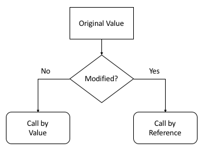

# Memory Layout of a C Program

## Memory Segments Overview

| Segment | Purpose | Direction | Access | Lifetime |
|---------|---------|-----------|--------|----------|
| **Text** | Executable code | Fixed | Read-Only | Program |
| **Data** | Initialized global/static vars | Fixed | Read-Write | Program |
| **BSS**  | Uninitialized global/static vars | Fixed | Read-Write | Program |
| **Heap** | Dynamic memory allocation | ↑ Growth | Read-Write | Manual |
| **Stack** | Local variables, function calls | ↓ Growth | Read-Write | Automatic |

## Detailed Segment Information

### Text Segment
- Stores executable instructions
- Read-only to prevent self-modification
- Shared among process instances
- Contains program's machine code

### Data Segment 
- Initialized global variables
- Initialized static variables
- Explicit non-zero initial values
- Physically stored in executable

### BSS Segment 
- Uninitialized global variables
- Zero-initialized variables
- Not stored in executable (size only)
- OS initializes to zero at startup

### Heap Segment
- Dynamic memory allocation
- Managed via malloc/calloc/realloc
- Freed manually with free()
- Grows towards higher addresses
- Potential for fragmentation

### Stack Segment
- Automatic storage duration
- Function parameters
- Local variables
- Return addresses
- Grows towards lower addresses
- Automatic management

## Memory Organization





---

## Example C Program

```c
#include <stdio.h>
#include <stdlib.h>

// Global variables
int g1 = 10;          // Initialized Data Segment
int g2;               // BSS Segment

// Static variables
static int s1 = 5;    // Initialized Data Segment
static int s2;        // BSS Segment

// Function (part of Text Segment)
void show() {
    int local = 20;   // Stack
    printf("Local variable (stack): %d\n", local);
}

int main(int argc, char *argv[]) {
    int x = 100;      // Stack

    // Dynamic allocation (Heap)
    int *ptr = (int*)malloc(sizeof(int) * 3);
    ptr[0] = 1;
    ptr[1] = 2;
    ptr[2] = 3;

    printf("Global initialized (data): %d\n", g1);
    printf("Global uninitialized (bss): %d\n", g2);
    printf("Static initialized (data): %d\n", s1);
    printf("Static uninitialized (bss): %d\n", s2);
    printf("Local variable (stack): %d\n", x);
    printf("Heap values: %d %d %d\n", ptr[0], ptr[1], ptr[2]);

    show();

    free(ptr); // Free allocated memory
    return 0;
}
```  


# Program Output (Table Format)

| Section                      | Value     |
|------------------------------|-----------|
| Global initialized (data)    | 10        |
| Global uninitialized (bss)   | 0         |
| Static initialized (data)    | 5         |
| Static uninitialized (bss)   | 0         |
| Local variable (stack)       | 100       |
| Heap values                  | 1 2 3     |
| Local variable (stack)       | 20        |

